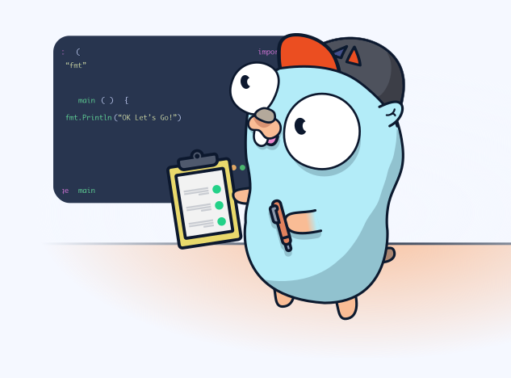

  提高 Go 基础知识方面的技能，编写生产级软件的核心设计理念、指南和习惯用法。  
🚀 目标实现共七阶段 🚀

## 🌐 目录

🧩初级 - 中级 - 高级

+ [阶段一：面向开发人员的实用 Go](./md/go_stage_1.md)
+ 2
+ 3
+ 4
+ 5
+ 6
+ 7

## 🌈 关于

如果你有任何问题，建议或贡献，欢迎联系我。你也可以在我的 [GitHub Profile](https://github.com/your-username) 查看其他项目和资源。

Happy DevOps Learning! 🌟
